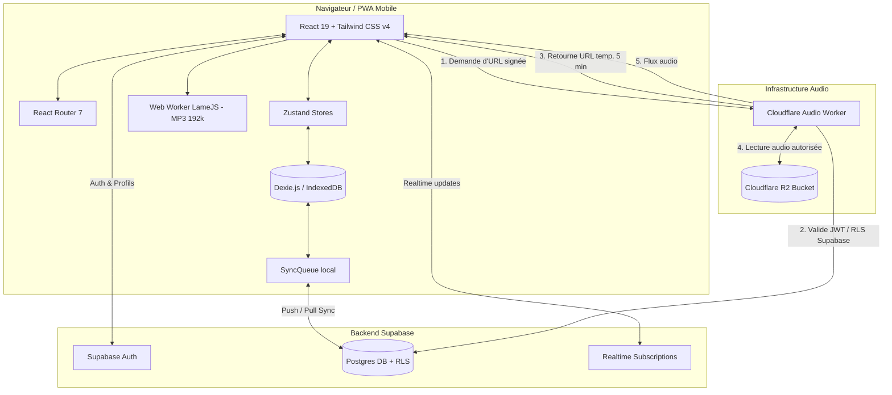

# FaderZero PWA

FaderZero est une application PWA mobile-first conçue pour les musiciens et les groupes. Elle permet de gérer l'intégralité du répertoire, de préparer des setlists de concert, d'organiser et d'écouter les pistes audio utiles, de lancer les outils de scène (prompteur et métronome) et de synchroniser les données d'un groupe en mode offline-first.

Déploiement public : [https://fader.pages.dev](https://fader.pages.dev)

---

## Sommaire

- [À quoi sert l'application](#à-quoi-sert-lapplication)
- [Fonctionnalités principales](#fonctionnalités-principales)
- [Parcours utilisateur type](#parcours-utilisateur-type)
- [Utilisation par écran](#utilisation-par-écran)
- [Usage hors ligne](#usage-hors-ligne)
- [Architecture technique](#architecture-technique)
- [Structure du projet](#structure-du-projet)
- [Guide de développement](#guide-de-développement)
- [Documentation complémentaire](#documentation-complémentaire)

---

## À quoi sert l'application

FaderZero regroupe tous les besoins quotidiens d'un groupe ou d'un musicien solo dans une seule interface réactive :

- **Centraliser le répertoire** : stocker chansons, paroles, tonalités, BPM, structures et notes de travail.
- **Construire des setlists** : organiser l'ordre des morceaux pour les répétitions ou les concerts, ajouter des annotations et exporter en PDF.
- **Gérer les médias audio** : importer, convertir en MP3, écouter en arrière-plan et mettre en cache les pistes d'accompagnement ou de référence.
- **Capturer les idées en direct** : enregistrer des mémos vocaux rapides depuis l'app et les associer aux morceaux.
- **Piloter la scène** : afficher le prompteur à défilement automatique et lancer le métronome avec Tap Tempo.
- **Collaborer en groupe** : partager des espaces de travail sécurisés avec gestion des rôles (Admin, Membre, Invité) et invitations par lien.
- **Fonctionner partout** : continuer à travailler sans réseau grâce au stockage local (IndexedDB) et à la synchronisation cloud différée ou au transfert local par QR code.

---

## Fonctionnalités principales

### 1. Espaces de travail et collaboration
- **Mon espace (Personnel)** : un espace privé automatique pour chaque compte.
- **Espaces de groupe** : création et accès à plusieurs espaces partagés pour collaborer avec d'autres membres.
- **Gestion des rôles** :
  - **Administrateur** : gestion complète des contenus, membres, rôles, paramètres et suppression d'espace.
  - **Membre** : création, édition et suppression des morceaux, setlists, audios et événements.
  - **Invité** : accès en lecture seule avec écoute et mise en cache audio locale.
- **Invitations sécurisées** : génération de liens d'invitation avec attribution de rôle, expiration sous 24 heures et limite de 5 liens actifs par rôle.
- **Copie entre espaces** : transfert de morceaux d'un espace à un autre avec choix sélectif des audios rattachés et contrôle automatique des quotas.

### 2. Répertoire et éditeur enrichi
- **Fiche morceau complète** : titre, artiste, statut (*Idée*, *En cours*, *Prêt*), BPM, tonalité, durée estimée et notes.
- **Éditeur de paroles TipTap** : éditeur structuré avec sections, annulation et rétablissement des modifications.
- **Recherche et tri** : recherche par titre et tri alphabétique ou par date de mise à jour.

### 3. Enregistreur vocal rapide
- **Capture instantanée** : enregistrement audio depuis le microphone (API Web MediaRecorder) accessible via le bouton d'action rapide.
- **Rattachement flexible** : association du mémo vocal à une chanson existante ou création d'une nouvelle chanson à la volée.

### 4. Gestion audio, conversion et cache
- **Import audio** : sélection des formats audio décodables par le navigateur, puis normalisation avant l'envoi.
- **Conversion locale automatique** : encodage des audios en MP3 192 kbps via Web Worker et LameJS pour préserver le stockage et la bande passante.
- **Lecteur audio intégré** : lecteur persistant avec sélection de la piste principale par morceau.
- **Cache hors ligne** : téléchargement local des pistes audio pour une lecture garantie sans connexion.
- **Gestion des quotas** : suivi du stockage utilisé (1 heure cumulée dans Mon espace, 5 Go par espace de groupe).

### 5. Setlists et export PDF
- **Organisation de concert** : ajout et réordonnancement des morceaux, affichage/masquage contextuel du BPM et de la tonalité.
- **Annotations et transitions** : remarques par morceau, enchaînements directs (*segues*) et annotation de fin de setlist.
- **Export PDF** : génération d'un document PDF propre et lisible pour l'impression ou la lecture sur tablette.

### 6. Outillage de scène (Prompteur et Métronome)
- **Prompteur réactif** :
  - Défilement automatique fluide avec ajustement de la vitesse et de la taille du texte.
  - Navigation rapide entre les morceaux d'une setlist ou du répertoire.
  - Mode plein écran.
- **Métronome (Click)** :
  - Réglage précis du BPM et Tap Tempo.
  - Choix de la signature temporelle (nombre de temps par mesure).
  - Indication visuelle et sonore du battement.

### 7. Calendrier et événements
- **Planification** : création d'événements (répétitions, concerts, réunions, autre).
- **Vue globale ou filtrée** : aperçu des 3 prochains événements sur l'accueil ou consultation du calendrier complet par espace.

### 8. Synchronisation et transfert QR
- **Synchronisation Cloud Supabase** : moteur offline-first enregistrant les mutations localement (`syncQueue`) avant d'effectuer des requêtes push/pull incrémentales.
- **Résolution de conflits** : détection des divergences et interface d'arbitrage manuel des versions.
- **Transfert local QR code** : export et import de données entre appareils hors ligne via des séquences de QR codes compressés (LZ-String).

### 9. Corbeille, profil et sécurité
- **Corbeille (Soft Delete)** : conservation des éléments supprimés pendant 7 jours avec restauration possible et toast d'annulation immédiate (5s).
- **Profil utilisateur** : gestion du pseudo, avatar WebP personnalisé (512×512) ou initiales générées.
- **Sécurité du compte** : changement de mot de passe avec règles de complexité, procédure de modification d'e-mail et suppression définitive du compte.

---

## Parcours utilisateur type

1. **Inscription / Connexion** : créer un compte ou se connecter.
2. **Choix de l'espace** : utiliser *Mon espace* par défaut ou créer/rejoindre un groupe via un lien d'invitation.
3. **Alimentation du répertoire** : ajouter des chansons, rédiger les paroles et enregistrer des idées vocales.
4. **Importation audio** : importer les pistes d'accompagnement ou mémos audio et les associer aux morceaux.
5. **Préparation de la setlist** : créer une setlist, organiser l'ordre des titres et ajuster les annotations.
6. **Mise en cache avant scène** : télécharger les fichiers audio en cache hors ligne pour garantir la lecture sans réseau.
7. **Répétition / Live** : lancer le prompteur pour afficher les paroles et utiliser le métronome pour caler le tempo.
8. **Synchronisation** : laisser la synchro cloud mettre à jour le groupe ou utiliser le transfert QR hors connexion.

---

## Utilisation par écran

### Mon Espace (Accueil)
Page d'accueil centrale offrant un résumé d'activité :
- Raccourci vers les 3 prochains événements du calendrier.
- Section **Mes créations** avec accès aux 3 dernières nouveautés de votre espace personnel.
- Liste des cartes de vos groupes triées par activité récente.

### Calendrier (`/calendar`)
Gestion des événements du groupe ou personnels :
- Affichage chronologique des répétitions, concerts et réunions.
- Formulaire de création et d'édition des détails d'événement (date, lieu, notes).

### Répertoire (`/songs`)
Gestion globale des chansons d'un espace :
- Barre de recherche textuelle et filtres de tri (titre, date).
- Fiche de détails d'une chanson avec statut, tonalité, BPM, notes et liste des audios rattachés.
- Éditeur de paroles complet (`/songs/:songId/write`) avec mise en forme dynamique.

### Musique (`/musiques`)
Gestion des fichiers audio :
- Liste des audios importés et mémos vocaux enregistrés.
- Rapprochement entre audios et morceaux du répertoire.
- Actions d'écoute, de mise en cache hors ligne et de suppression.

### Setlists (`/setlists`)
Gestion des programmes de concert :
- Création, recherche et consultation des setlists.
- Vue détaillée (`/setlists/:setlistId`) avec réorganisation des morceaux, ajout de notes de transition, activation de segues et export PDF.

### Prompteur (`/prompter` et `/prompter/play`)
Interface dédiée à l'affichage scénique :
- Sélection d'une setlist ou du répertoire global.
- Contrôles du défilement automatique, de la vitesse, de la taille du texte et du plein écran.

### Métronome (`/metronome`)
Outil de calage temporel :
- Définition du BPM au curseur ou via Tap Tempo.
- Réglage du nombre de temps par mesure et signal sonore/visuel.

### Sync (`/sync`)
Panneau de contrôle de la synchronisation :
- État de la connexion cloud et détails du compte / workspace courant.
- Visualisation de la file des modifications en attente.
- Déclenchement manuel de la synchro et résolution des conflits.
- Onglet de transfert par QR code pour l'échange de données sans internet.

### Compte (`/account`)
Paramètres personnels et d'administration :
- Profil utilisateur (pseudo, photo/avatar).
- Sécurité (mot de passe, changement d'e-mail, suppression de compte).
- Gestion des workspaces : création de groupe, invitations par lien, gestion des membres et des rôles.
- Accès à la corbeille de l'espace actif et libération du cache audio local.

---

## Usage hors ligne

FaderZero est conçu avec une approche **offline-first** :

1. **Disponibilité des données** : toutes les chansons, setlists, événements et métadonnées sont stockés localement dans IndexedDB via Dexie.js.
2. **File d'attente de synchronisation** : les modifications effectuées hors ligne sont enregistrées dans la table `syncQueue` et poussées vers le serveur dès que le réseau est réétabli.
3. **Audio hors ligne** : les fichiers audio téléchargés en cache restent lisibles à tout moment sans connexion réseau.
4. **Transfert QR** : en cas d'absence totale d'internet, les morceaux et setlists peuvent être transférés d'un appareil à un autre en scannant une suite de QR codes.

*Recommandation pour le live :* Avant de monter sur scène, ouvrez l'application connecté au réseau pour synchroniser les dernières modifications du groupe et mettez en cache les audios nécessaires.

---

## Architecture technique

L'application repose sur une architecture moderne, découplée et orientée performance mobile.



### Stack technique principal
- **Frontend** : React 19, TypeScript (strict mode), Vite 8, Tailwind CSS v4, React Router 7.
- **PWA** : Service Worker généré via `vite-plugin-pwa` avec stratégies d'auto-update et installation sur écran d'accueil.
- **Base de données locale** : Dexie.js 4 (wrapper IndexedDB) avec migrations de schéma versionnées (v1 à v12) et repositories d'accès aux données dans `src/db/repositories/`.
- **Backend & Authentification** : Supabase Auth (JWT) et base de données PostgreSQL avec règles de sécurité RLS (*Row Level Security*) par workspace.
- **Gestion audio & Stockage objet** :
  - Fichiers MP3 physiques hébergés dans un bucket **Cloudflare R2**.
  - Worker Edge Cloudflare (`cloudflare/audio-worker`) sécurisant les accès : vérification des rôles Supabase, validation de la structure MP3 et génération d'URLs de lecture signées (valables 5 minutes).
  - Traitement audio côté client : réencodage local MP3 192 kbps dans un Web Worker isolé avec `@breezystack/lamejs`.
- **Déploiement** : Hébergement de l'application statique sur **Cloudflare Pages**.

---

## Structure du projet

```text
.
├── cloudflare/              # Worker Cloudflare Edge pour la gestion sécurisée des audios R2
│   └── audio-worker/        # Code source, validation MP3 et tests du worker audio
├── docs/                    # Documentation technique, spécifications et guides
├── public/                  # Assets statiques, favicon et manifest PWA
├── scripts/                 # Scripts d'automatisation (déploiement, sécurité, audit)
├── src/
│   ├── app/                 # Point d'entrée de l'application et routage (router.tsx)
│   ├── components/          # Composants UI partagés (AppShell, FormDialog, Modals, Badges)
│   ├── db/                  # Dexie.js : schéma, configuration IndexedDB et repositories
│   │   └── repositories/    # Abstraction d'accès aux tables locales (songs, setlists, events, assets)
│   ├── features/            # Modules fonctionnels de l'application
│   │   ├── account/         # Profil, gestion du compte et administration des espaces
│   │   ├── audio/           # Mini-lecteur audio persistant
│   │   ├── events/          # Calendrier et gestion des événements
│   │   ├── home/            # Page d'accueil Mon Espace et actualités
│   │   ├── imports/         # Importation, encodage et gestion des pistes audio
│   │   ├── metronome/       # Outil métronome et Tap Tempo
│   │   ├── prompter/        # Prompteur de scène et défilement de paroles
│   │   ├── recorder/        # Enregistreur vocal rapide (memo vocal)
│   │   ├── setlists/        # Édition des setlists et export PDF
│   │   ├── songs/           # Gestion du répertoire et éditeur de paroles TipTap
│   │   ├── sync/            # Synchronisation cloud et transfert QR hors ligne
│   │   └── trash/           # Modale de restauration et gestion de la corbeille
│   ├── hooks/               # Hooks React personnalisés (statut réseau, appui long)
│   ├── lib/                 # Utilitaires génériques (identifiants, horodatage)
│   ├── services/            # Logique métier et intégrations externes
│   │   ├── audio/           # Client R2 et gestionnaire d'uploads d'audio
│   │   ├── supabase/        # Intégration Supabase (Auth, RLS, sync, profils, quotas, corbeille)
│   │   └── sync/            # Moteur de synchronisation offline-first
│   └── stores/              # État global d'authentification avec Zustand
├── supabase/                # Migrations SQL, schémas DB et fonctions RPC Supabase
├── vite.config.ts           # Configuration Vite, Tailwind et plugin PWA
└── package.json             # Dépendances et scripts npm
```

---

## Guide de développement

### Prérequis
- **Node.js** et **npm**, dans des versions compatibles avec les dépendances du projet.

### Installation

1. Cloner le projet et installer les dépendances :
   ```bash
   npm install
   ```

2. Configurer les variables d'environnement :
   Créer un fichier `.env` à la racine à partir de `.env.example` :
   ```env
   VITE_SUPABASE_URL=https://votre-projet.supabase.co
   VITE_SUPABASE_ANON_KEY=votre-cle-anon-supabase
   VITE_AUDIO_API_URL=https://votre-audio-worker.workers.dev
   ```

### Scripts npm disponibles

- **Lancer l'application en développement** :
  ```bash
  npm run dev
  ```
- **Vérification du typage TypeScript** :
  ```bash
  npm run typecheck
  ```
- **Linter le code source** :
  ```bash
  npm run lint
  ```
- **Lancer les tests unitaires et d'intégration** :
  ```bash
  npm run test
  ```
- **Compiler l'application pour la production** :
  ```bash
  npm run build
  ```
- **Prévisualiser le build de production** :
  ```bash
  npm run preview
  ```
- **Environnement local pour le worker audio** :
  ```bash
  npm run dev:audio
  ```

---

## Documentation complémentaire

Pour en savoir plus sur des aspects techniques spécifiques, consultez les documents dans le dossier `docs/` :

- **Spécifications fonctionnelles** : `docs/FONCTIONNALITES_FADERZERO.md`
- **Audit de sécurité** : `docs/AUDIT_SECURITE_FADERZERO.md`
- **Migrations et configuration Supabase** : `supabase/`

---

## État du document

Ce README reflète l'état actuel des fonctionnalités livrées et validées dans la codebase de FaderZero PWA.
